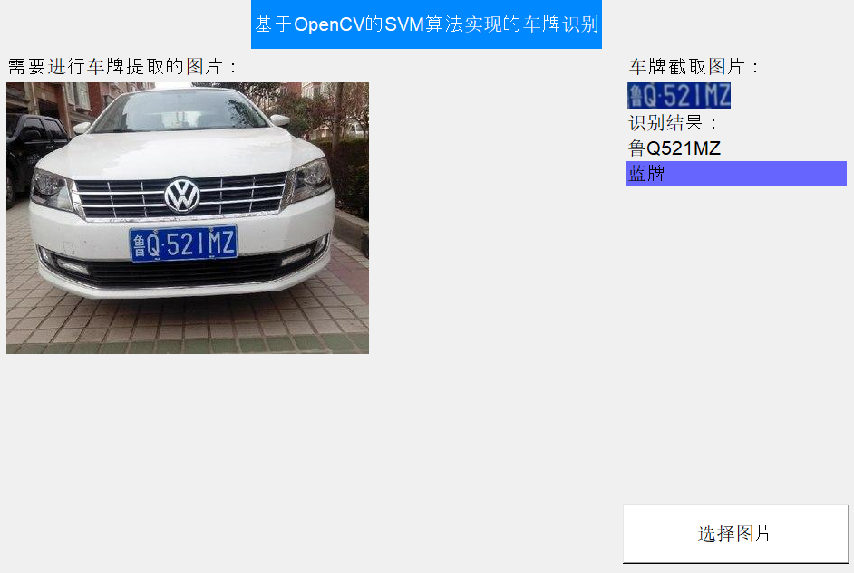
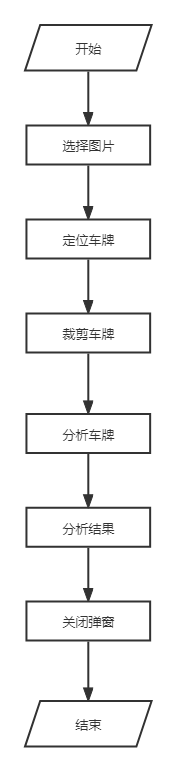
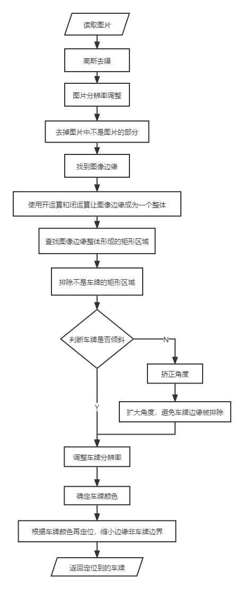
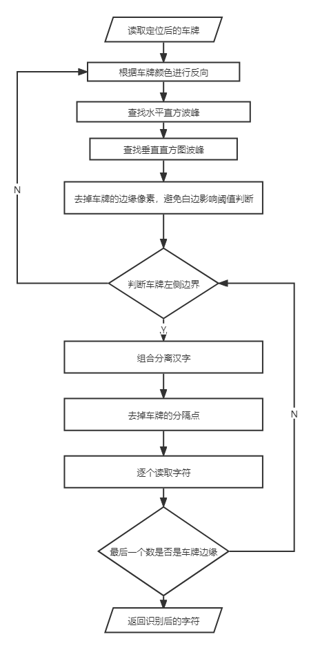

# python-opencv

> 用python3+opencv3做的车牌识别，包括算法和客户端界面
> 
> `surface.py`是界面代码
> 
> `predict.py`是算法代码(`tkinter`)。

## 使用方法：

>版本：`python3.10.1，opencv3.4和numpy1.14和PIL5<br>

1. 确保本机已经安装`python3.x`以及`pip`

2. 进入项目根目录，执行`install.sh`来安装对应的依赖

   ```
   ./install.sh
   ```

3. 执行成功后可以直接执行`run.sh` 或者 `python ./surface.py`

## 成果展示




## 算法实现：

1. 先使用图像边缘和车牌颜色定位车牌
2. 识别字符
3. 车牌定位在predict方法中
   1. 车牌字符识别使用的算法是opencv的SVM
   2. opencv的SVM使用代码来自于opencv附带的sample
   3. StatModel类和SVM类都是sample中的代码
4. SVM训练使用的训练样本来自于github上的EasyPR的c++版本。
5. 由于训练样本有限
6. 上传了EasyPR中的训练样本，在`train\`目录下
7. 如果要重新训练请解压在当前目录下，并删除原始训练数据文件`svm.dat`和`svmchinese.dat`。

## 流程概述

### 整体流程



### 车牌定位流程



### 读取车牌字符

